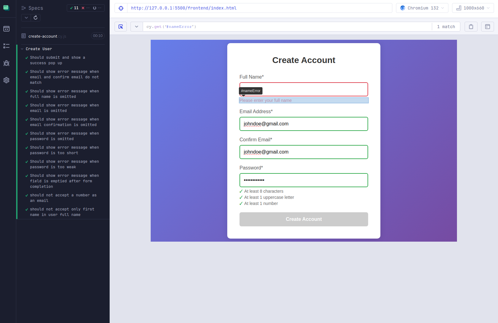
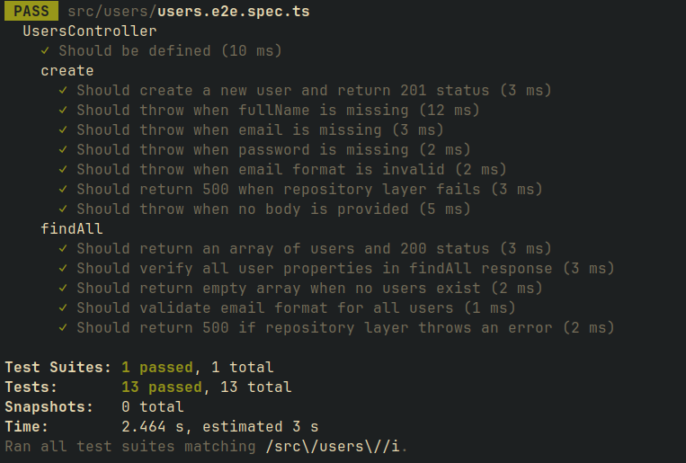
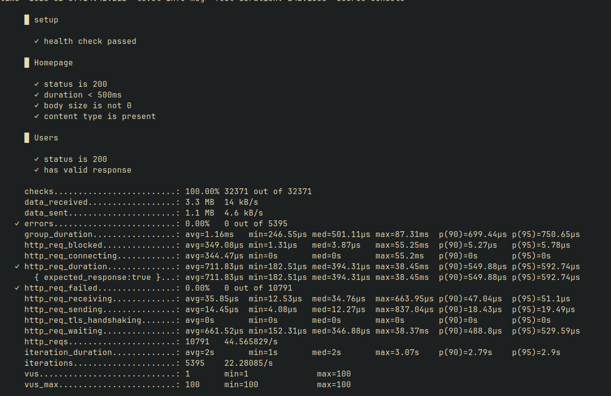

# Front-ent Testing:

```
npx cypress open
```

## Image Evidence:



## Test Cases:

- Should submit and show a success pop up
- Should show error message when email and confirm email do not match
- Should show error message when full name is omitted
- Should show error message when email is omitted
- Should show error message when email confirmation is omitted
- Should show error message when password is omitted
- Should show error message when password is too short
- Should show error message when password is too weak
- Should show error message when field is emptied after form completion
- should not accept a number as an email
- should not accept only first name in user full name

# Back-end API Testing

```
cd backend
npx nest new backend
```

### Image Evidence:



## Test Cases:

### POST

- Should create a new user and return 201 status
- Should throw when fullName is missing
- Should throw when email is missing
- Should throw when password is missing
- Should throw when email format is invalid
- Should return 500 when repository layer fails
- Should throw when no body is provided

### GET

- Should return an array of users and 200 status
- Should verify all user properties in findAll response
- Should return empty array when no users exist
- Should return 500 if repository layer throws an error

# Back-end Performance Testing

```
cd backend
nest start

docker pull grafana/k6
cd ../k6
docker run --rm -i --network=host grafana/k6 run - <script.js
```

## Image Evidence


